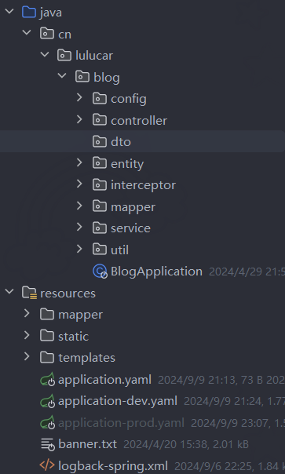

# Blog （正在学习中）
## 技术栈
- SpringBoot3
- Mybatis
- Thymeleaf

## 账号密码
- 管理员：lulucar/123123

## 学习作者项目
ZHENFENG13/My-Blog
=======
## 项目展示
### 登录页面

### 后台管理
首页

发布文章

文章管理

评论管理

标签管理


### 前台
首页


##  项目依赖

- - thymeleaf 模板引擎
- web 场景启动器（传统 web 结构）
- session 会话管理
- hutool 多功能开发工具包 （生成验证码）
- commonmark 解析器（把 markdown 转为 html）
- mysql 连接驱动
- redis 缓存
- mybatis ORM 框架

## 项目目录结构




##  配置文件修改

改为多配置文件：`application-dev.yaml`、`application-prod.yaml`

- 配置数据源 mysql。
- 配置连接池 hikari。
- 配置 mybatis。
- 配置 redis

> 展示 `application-dev.yaml` 内容

```yaml
spring:
  application:
    name: Blog
  # 配置数据源
  datasource:
    name: blog-datasource
    driver-class-name: com.mysql.cj.jdbc.Driver
    url: jdbc:mysql://127.0.0.1:3306/my_blog_db?useUnicode=true&characterEncoding=utf8&autoReconnect=true&useSSL=false&serverTimezone=UTC
    username: root
    password: 88888888
    type: com.zaxxer.hikari.HikariDataSource

    # 配置连接池信息
    hikari:
      minimum-idle: 5
      maximum-pool-size: 15
      auto-commit: true
      idle-timeout: 120000
      pool-name: hikariCP
      max-lifetime: 30000
      connection-timeout: 30000
      connection-test-query: SELECT 1
      
  thymeleaf:
    cache: false
    prefix: classpath:/templates/
    suffix: .html
    servlet:
      content-type: text/html
    encoding: UTF-8
    mode: HTML
  
  mvc:
    static-path-pattern: /**
    
  servlet:
    # 文件上传大小限制
    multipart:
      max-file-size: 50MB
      max-request-size: 100MB
  web:
    resources:
      static-locations: classpath:/static/
  # 日志输出着色
  output:
    ansi:
      enabled: detect

# 整合 mybatis 配置
mybatis:
  # 配置 xml 文件位置
  mapper-locations: classpath:/mapper/*.xml
  configuration:
    # 开启驼峰命名法
    map-underscore-to-camel-case: true

server:
  # 端口
  port: 28083

# 日志级别
logging:
  group:
    group1:
#      - cn.lulucar.blog.controller
#      - cn.lulucar.blog.service
      - cn.lulucar.blog.mapper
  level:
    group1: debug
  
# 定义文件上传目录  
file: 
  upload: 
    path: E:/upload/
```

##  工具类 Utils

###  FileNameGenerator

> 文件名生成器

:pencil: 参数是上传文件的原名称，根据原名称生成规定名称。

```java
public class FileNameGenerator {
    public static String generateNewFileName(String originalFileName) {
        // 去除原始文件后缀
        String fileNameWithoutExtension = originalFileName.substring(0,originalFileName.indexOf("."));
        // 文件后缀
        String suffixName = originalFileName.substring(originalFileName.indexOf("."));
        // 生成时间戳
        String timestamp = LocalDateTime.now().format(DateTimeFormatter.ofPattern("yyyyMMdd_HHmmss"));
        
        // 将文件名（不带后缀）与时间戳合并

        return fileNameWithoutExtension + "_" + timestamp + suffixName;
    }
}
```


###  MarkDownUtil

> md格式文本工具

:pencil: 第一个方法`mdToHtml`把md文本转为Html文本

:pencil: 第二个方法`mdToHtmlForSummary` 截取Html文本前三个`<p>`标签内容

```java
public class MarkDownUtil {
    /**
     * 转换md格式为html
     *
     * @param markdownString md文本
     * @return 返回HTML文本
     */
    public static String mdToHtml(String markdownString) {
        if (!StringUtils.hasText(markdownString)) {
            return "";
        }
        List<Extension> extensions = Arrays.asList(TablesExtension.create());
        Parser parser = Parser.builder().extensions(extensions).build();
        Node document = parser.parse(markdownString);
        HtmlRenderer renderer = HtmlRenderer.builder().extensions(extensions).build();
        return renderer.render(document);
    }

    /**
     * 截取博客文章作摘要
     * @param markdownString
     * @return
     */
    public static String mdToHtmlForSummary(String markdownString) {
        String html = mdToHtml(markdownString);
        Document document = Jsoup.parse(html);
        Elements paragraphs = document.select("p");
        // 使用 StringBuilder 来拼接p标签的文本内容
        StringBuilder sb = new StringBuilder();
        // 截取前3个p标签，如果没有三个，就截取所有p标签
        int maxToSelect = Math.min(paragraphs.size(),3);

        for (int i = 0; i < maxToSelect; i++) {
            Element paragraph = paragraphs.get(i);
            String text = paragraph.text();
            sb.append(text);
            // 可以在这里添加分隔符，比如换行符或空格  
            if (i < maxToSelect - 1) {
                sb.append("\n"); // 或者使用其他分隔符，比如sb.append(" ");  
            }
        }
        return sb.toString();
    }

}
```


###  PageResult

> 分页数据结果集

:pencil: 统一封装查询分页数据

```java
@Data
public class PageResult implements Serializable {
    //总记录数
    private int totalCount;
    //每页记录数
    private int pageSize;
    //总页数
    private int totalPage;
    //当前页数
    private int currPage;
    //列表数据
    private List<?> list;

    /**
     * 分页
     *
     * @param list       列表数据
     * @param totalCount 总记录数
     * @param pageSize   每页记录数
     * @param currPage   当前页数
     */
    public PageResult(List<?> list, int totalCount, int pageSize, int currPage) {
        this.list = list;
        this.totalCount = totalCount;
        this.pageSize = pageSize;
        this.currPage = currPage;
        this.totalPage = (int) Math.ceil((double) totalCount / pageSize);
    }
}
```


###  PageQueryUtil

> 封装分页参数为LinkedHashMap集合

:pencil: 接口请求的参数和分页参数封装在集合中

```java
@EqualsAndHashCode(callSuper = true)
@Data
public class PageQueryUtil extends LinkedHashMap<String,Object> {
    //当前页码
    private int page;
    //每页条数
    private int limit;
    // 把分页所需要的参数封装进Map集合中
    public PageQueryUtil(Map<String, Object> params) {
        this.putAll(params);

        //分页参数
        this.page = Integer.parseInt(params.get("page").toString());
        this.limit = Integer.parseInt(params.get("limit").toString());
        this.put("start", (page - 1) * limit);
        this.put("page", page);
        this.put("limit", limit);
    }
    @Override
    public String toString() {
        return "PageUtil{" +
                "page=" + page +
                ", limit=" + limit +
                '}';
    }

}
```


###  PasswordEncodeUtil

> 加密密码

:fire: 已经删除，通过注入`BCryptPasswordEncoder` 实现对密码的加密。

###  PatternUtil

> 匹配模式判断

:pencil: 第一个是匹配邮箱的正则表达式。

:pencil: 第二个方法对搜索关键字的合法性判断。

:pencil: 第三个方法对邮箱的合法性判断。

:pencil: 第四个方法对URL地址合法性判断。

```java
public class PatternUtil {

    /**
     * 匹配邮箱正则
     */
    private static final Pattern VALID_EMAIL_ADDRESS_REGEX =
            Pattern.compile("^[A-Z0-9._%+-]+@[A-Z0-9.-]+\\.[A-Z]{2,6}$", Pattern.CASE_INSENSITIVE);

    /**
     * 验证只包含中英文和数字的字符串
     *
     * @param keyword
     * @return
     */
    public static Boolean validKeyword(String keyword) {
        String regex = "^[a-zA-Z0-9\u4E00-\u9FA5?]+$";
        Pattern pattern = Pattern.compile(regex);
        Matcher match = pattern.matcher(keyword);
        return match.matches();
    }


    /**
     * 判断是否是邮箱
     *
     * @param emailStr
     * @return
     */
    public static boolean isEmail(String emailStr) {
        Matcher matcher = VALID_EMAIL_ADDRESS_REGEX.matcher(emailStr);
        return matcher.find();
    }

    /**
     * 判断是否是网址
     *
     * @param urlString
     * @return
     */
    public static boolean isURL(String urlString) {
        String regex = "^([hH][tT]{2}[pP]:/*|[hH][tT]{2}[pP][sS]:/*|[fF][tT][pP]:/*)(([A-Za-z0-9-~]+).)+([A-Za-z0-9-~\\/])+(\\?{0,1}(([A-Za-z0-9-~]+\\={0,1})([A-Za-z0-9-~]*)\\&{0,1})*)$";
        Pattern pattern = Pattern.compile(regex);
        if (pattern.matcher(urlString).matches()) {
            return true;
        } else {
            return false;
        }
    }

}
```


###  Result

> 响应结果

:pencil: 请求接口后，返回响应结果。

```java
@Data
@NoArgsConstructor
@AllArgsConstructor
public class Result implements Serializable {
    @Serial
    private static final long serialVersionUID = 1L;
    private int resultCode;
    private String message;
    private Object data;
    

    @Override
    public String toString() {
        return "Result{" +
                "resultCode=" + resultCode +
                ", message='" + message + '\'' +
                ", data=" + data +
                '}';
    }
}
```


###  ResultGenerator

> 响应结果生成器

:pencil: 第一个方法返回无参响应结果集

:pencil: 第二个方法返回携带响应成功消息的结果集

:pencil: 第三个方法返回携带数据的结果集

:pencil: 第四个方法返回携带响应失败消息的结果集

```java
public class ResultGenerator {
  private static final String DEFAULT_SUCCESS_MESSAGE = "SUCCESS";
  private static final String DEFAULT_FAIL_MESSAGE = "FAIL";
  private static final int RESULT_CODE_SUCCESS = 200;
  private static final int RESULT_CODE_SERVER_ERROR = 500;

  public static Result genSuccessResult() {
    Result result = new Result();
    result.setResultCode(RESULT_CODE_SUCCESS);
    result.setMessage(DEFAULT_SUCCESS_MESSAGE);
    return result;
  }

  public static Result genSuccessResult(Object data) {
    Result result = new Result();
    result.setResultCode(RESULT_CODE_SUCCESS);
    result.setMessage(DEFAULT_SUCCESS_MESSAGE);
    result.setData(data);
    return result;
  }

  public static Result genFailResult(String message) {
    Result result = new Result();
    result.setResultCode(RESULT_CODE_SERVER_ERROR);
    if (!StringUtils.hasText(message)) {
      result.setMessage(DEFAULT_FAIL_MESSAGE);
    } else {
      result.setMessage(message);
    }
    return result;
  }

  public static Result genErrorResult(int code, String message) {
    Result result = new Result();
    result.setResultCode(code);
    result.setMessage(message);
    return result;
  }
}
```

## Redis

### 配置

#### Redis 序列化配置

> **序列化配置**

```java
@Configuration
public class RedisConfiguration {
    /**
     * @param redisConnectionFactory    Redis 自己配置好了连接工厂
     * 两种连接工厂 Lettuce 和 Jedis
     * 默认使用 lettuce
     * @return
     */
    @Bean
    public RedisTemplate<String, Object> redisTemplate(RedisConnectionFactory redisConnectionFactory) {
        RedisTemplate<String, Object> template = new RedisTemplate<>();
        //创建一个createObjectMapperConfig对象
        CreateObjectMapperConfig createObjectMapperConfig = new CreateObjectMapperConfig();
        // ObjectMapper 转译
        ObjectMapper objectMapper = createObjectMapperConfig.createObjectMapper();

        // Json 序列化配置
        Jackson2JsonRedisSerializer<Object> objectJackson2JsonRedisSerializer = new Jackson2JsonRedisSerializer<>(objectMapper, Object.class);

        // 设置连接工厂
        template.setConnectionFactory(redisConnectionFactory);
        // 把对象转为 JSON 格式
        template.setDefaultSerializer(objectJackson2JsonRedisSerializer);
        // key设置StringRedisSerializer序列化
        template.setKeySerializer(new StringRedisSerializer());
        // value设置GenericJackson2JsonRedisSerializer序列化
        template.setValueSerializer(objectJackson2JsonRedisSerializer);
        // Hash key设置string，value设置json
        template.setHashKeySerializer(new StringRedisSerializer());
        template.setValueSerializer(objectJackson2JsonRedisSerializer);
        return template;
    }
}
```

> **utf-8时间匹配**

```java
@Component
public class CreateObjectMapperConfig {
    /**
     * 
     * 自定义 objectMapper
     */
    @Bean
    public ObjectMapper createObjectMapper() {
        ObjectMapper objectMapper = new ObjectMapper();

        objectMapper.setDateFormat(new SimpleDateFormat("yyyy-MM-dd HH:mm:ss"));
        objectMapper.setTimeZone(TimeZone.getTimeZone("GMT+8"));
        objectMapper.registerModule(new JavaTimeModule());
        // 设置序列化规则
        objectMapper.setVisibility(PropertyAccessor.ALL, JsonAutoDetect.Visibility.ANY);
        objectMapper.activateDefaultTyping(
                LaissezFaireSubTypeValidator.instance,
                ObjectMapper.DefaultTyping.NON_FINAL,
                JsonTypeInfo.As.WRAPPER_ARRAY
        );
        objectMapper.configure(DeserializationFeature.FAIL_ON_UNKNOWN_PROPERTIES, false);

        return objectMapper;
    }
}
```

#### Redis 工具类封装操作

**封装常用方法**

```java
@Component
public class RedisUtils {
    @Resource
    private RedisTemplate<String,Object> redisTemplate;
    
    // ================= string 数据类型 ==================

    // 设置键值对
    public void set(String key, Object value) {
        redisTemplate.opsForValue().set(key, value);
    }

    // 设置键值对并指定过期时间
    public void set(String key, Object value, long timeout, TimeUnit unit) {
        redisTemplate.opsForValue().set(key, value, timeout, unit);
    }

    // 设置键值对并指定过期时间
    public void set(String key, Object value, long seconds) {
        redisTemplate.opsForValue().set(key, value, seconds, TimeUnit.SECONDS);
    }
    
    // 获取值
    public Object get(String key) {
        return redisTemplate.opsForValue().get(key);
    }
    // 获取多个值
    public List<Object> mGet(String... keys) {
        return redisTemplate.opsForValue().multiGet(List.of(keys));
    }
    // 获取值
    public String getString(String key) {
        Object obj = redisTemplate.opsForValue().get(key);
        return obj == null ? null : obj.toString();
    }

    // 删除键
    public Boolean delete(String key) {
        return redisTemplate.delete(key);
    }

    // 判断键是否存在
    public Boolean hasKey(String key) {
        return redisTemplate.hasKey(key);
    }

    // 如果不存在，则设置
    public Boolean setNx(String key, Object value) {
        return redisTemplate.opsForValue().setIfAbsent(key, value);
    }

    // 如果不存在，则设置，附带过期时间
    public Boolean tryLock(String lockKey, String requestId, long seconds) {
        return redisTemplate.opsForValue().setIfAbsent(lockKey, requestId, seconds, TimeUnit.SECONDS);
    }

    // 如果不存在，则设置，附带过期时间
    public Boolean tryLock(String lockKey, String requestId, long timeout, TimeUnit unit) {
        return redisTemplate.opsForValue().setIfAbsent(lockKey, requestId, timeout, unit);
    }

    // ================== list 数据类型 ==================
    
    // list 存入
    public void rPush(String key, Object value) {
        redisTemplate.opsForList().rightPush(key, value);
    }
    public void rPushAll(String key, List<?> values) {
        values.forEach(value -> redisTemplate.opsForList().rightPush(key, value));
    }
    // list 取出
    public List<Object> lRange(String key, long start, long end) {
        return redisTemplate.opsForList().range(key, start, end);
    }
    
    
    
    // =================== hash 数据类型 ==================
    
}
```

### redis 缓存预热

**实施**

使用 SpringBoot 的 `@PostConstruct` 注解，在项目启动后自动执行方法。

**具体代码**

```java
@Service
@Slf4j
public class redisService {
    private static final String BLOG_KEY_PREFIX = "blog:";
    private static final String BLOG_ID_LIST_KEY = "blog:id:list";
    private final RedisUtils redisUtils;
    private final BlogMapper blogMapper;

    public redisService(RedisUtils redisUtils, BlogMapper blogMapper) {
        this.redisUtils = redisUtils;
        this.blogMapper = blogMapper;
    }

    /**
     * 在 Spring Bean 初始化完成后自动执行的方法。
     */
    @PostConstruct
    public void initArticleIdsCache() {
        setBlogIds();
        setBlogList();
    }
    // =================== blog ===================

    /**
     * 将所有博客的 ID 存储到 Redis 中。
     */
    public void setBlogIds() {
        List<Integer> allBlogIds = blogMapper.getAllBlogIds();
        try {
            // 不存在则添加
            if (!redisUtils.hasKey(BLOG_ID_LIST_KEY)){
                redisUtils.rPushAll(BLOG_ID_LIST_KEY, allBlogIds);
            }
        } catch (Exception e) {
            log.error("Redis 运行出错，{}",e.getMessage());
        }
    }

    /**
     * 将所有博客对象存储到 Redis 中。
     */
    public void setBlogList() {
        try {
            List<Object> list = redisUtils.lRange(BLOG_ID_LIST_KEY, 0, -1);
            List<Integer> blogIds = list.stream().map(obj -> (Integer) obj).toList();
            blogIds.forEach(id -> {
                if (!redisUtils.hasKey(BLOG_KEY_PREFIX+id)) {
                    redisUtils.set(BLOG_KEY_PREFIX+id,blogMapper.selectByPrimaryKey(Long.valueOf(id)));
                }
            });
        } catch (Exception e) {
            log.error("Redis 运行出错，{}",e.getMessage());
        }
    }
}
```

**总结**

缓存预热就是程序启动后，主动将相关的数据直接加载到缓存。避免在用户请求的时候，先查询数据库，然后再将数据缓存的问题！用户直接查询事先被预热的缓存数据！从而减少了缓存穿透和缓存击穿的情况，也缓解了SQL服务器的压力。

### redis 更新缓存

采用先更新数据库，再删除缓存。

**更新策略**：

- **内存淘汰**：redis自动进行，当redis内存达到咱们设定的max-memery的时候，会自动触发淘汰机制，淘汰掉一些不重要的数据(可以自己设置策略方式)。
- **超时剔除**：当给 redis 设置了过期时间 TTL 之后，redis 会将超时的数据进行删除。
- **主动更新**：手动调用方法把缓存删除，解决缓存和数据库不一致问题。


### redis 缓存穿透

**定义**：缓存穿透是指客户端请求的数据在缓存中和数据库中都不存在，这样缓存永远不会生效，这些请求都会打到数据库。（穿透指的是穿透了缓存，直击数据库）

**解决方案**：

- 缓存空对象（该项目采用）

  - 优点：简单，方便
  - 缺点：额外内存消耗

  > 在进行校验 key 是否存在后，对第一次未查询到结果时，对该 key 设置一个2分钟过期的空 value，

- 布隆过滤器

  - 优点：内存占用少，没有多余的 key
  - 缺点：实现复杂

### redis 缓存击穿

**定义**：缓存击穿问题也叫**热点Key**问题，就是一个被**高并发访问**并且缓存重建业务较复杂的key突然失效了，无数的请求访问会在瞬间给数据库带来巨大的冲击。

**解决方案**：

- 互斥锁
  - 利用 **redis** 的 **setnx** 方法来表示获取锁，该方法含义是 redis 中如果没有这个 key，则插入成功，返回1，在stringRedisTemplate中返回true， 如果有这个key则插入失败，则返回0，在stringRedisTemplate返回false，我们可以通过true，或者是false，来表示是否有线程成功插入key，成功插入的key的线程我们认为他就是获得到锁的线程。
- 逻辑过期
  - 当用户开始查询redis时，判断是否命中，如果没有命中则直接返回空数据，不查询数据库，而一旦命中后，将value取出，判断value中的过期时间是否满足，如果没有过期，则直接返回redis中的数据，如果过期，则在开启独立线程后直接返回之前的数据，独立线程去重构数据，重构完成后释放互斥锁。

### redis 缓存雪崩

**定义**：缓存雪崩是指在同一时段**大量的缓存key同时失效或者Redis服务宕机**，导致大量请求到达数据库，带来巨大压力。

**解决方案**：

- 给不同的 key 的 TTL 添加随机值

  > 对项目运行阶段生产的文章采用随机生存时间。

- 让热点数据永不过期

  > 项目使用 `@PostConstruct` 在组建初始化完成后，把博客文章缓存到 Redis 中。

##  功能模块


###  **AdminUser** 模块:tada:

用户加密用到了 SpringBoot Security 依赖，利用其中包括的 `Bcrypt` 加密功能。

**功能：**

- 登录
- 修改密码
- 修改用户信息
- 注册
- 退出

### Blog 模块:tada:

blog 的 saveBlog 需要用到 分类，标签，博客标签关联

这些模块的`entity`的实体类需要把`Date`类型换成`LocalDateTime`类型。

:dart: 期望功能：

> :one: 再添加一个标签查询
>
> :two: 把分类、标签这些小量数据直接用多选框展示出来，直接点击查询

:warning: 代码改进：

> :one: 把重复的代码块抽取出新的方法

**功能：**

- 新增博客文章
- 查询博客文章列表
- 查询博客文章
  - Id 查询
  - 分类 查询
  - 标题 查询

- 批量删除博客文章
- 修改博客文章

###  BlogTag 模块:tada: 

博客的标签

:dart: 期望功能：

> :one: 可以直接删除标签，同时修改blog与tag的关联表 :ok:
>
> :two: 添加搜索功能，按名称搜索

**功能：**

- 查询标签列表
- 新增标签
- 删除标签

###  BlogComment 模块:tada:

关于博客文章的评论，其它用户给文章发表的评论。

**功能：**

- 审核评论
- 删除评论
- 回复评论

###  BlogCategory 模块:tada: 

博客文章所属的分类，每个博客发布都需要选择一个分类。

**功能：**

- 分类页面访问
- 查询分类列表
- 新增分类
- 修改分类
- 删除分类

###  BlogLink 模块:tada: 

友联管理

**功能：**

- 新增友联
- 修改友联
- 删除友联

###  BlogConfig 模块:tada: 

关于网站和作者的细节信息。

**功能：**

- 修改网站配置信息
- 修改作者配置信息
- 修改网站互联网配置信息


###  前台MyBlog:tada: 

**新增功能：**

- :rocket: 把展示文章图片改为展示文章内容摘要。

##  Spring MVC 框架

###  关于  request.setAttribute 和 model.setAttribute的区别

#### request.setAttribute

- **上下文**：`request.setAttribute` 是 **Servlet API 的一部分**，用于在 HTTP 请求的生命周期内设置属性。这些属性可以被同一个请求中的其他 Servlet、JSP 页面或过滤器访问。
- **使用场景**：当你不使用任何框架（如 Spring MVC），或者在使用传统的 Servlet/JSP 开发时，你可能会使用 `request.setAttribute` 来传递数据给 JSP 页面。

#### model.setAttribute

- **上下文**：`model.setAttribute` 是 **Spring MVC 中 `Model` 接口的一个方法**，用于在控制器和视图之间传递数据。`Model` 是一个接口，通常由 Spring 容器管理，并自动注入到控制器方法中。
- **使用场景**：当你使用 Spring MVC 框架开发 Web 应用程序时，你会在控制器中使用 `model.setAttribute` 来将数据添加到模型中，这些数据随后会被传递给视图进行渲染。

#### 主要区别

1. **上下文**：`request.setAttribute` 是 Servlet API 的一部分，而 `model.setAttribute` 是 Spring MVC 框架提供的。
2. **使用场景**：`request.setAttribute` 通常用于传统的 Servlet/JSP 开发，而 `model.setAttribute` 更多地与 Spring MVC 框架结合使用。
3. **集成度**：在 Spring MVC 中，`model.setAttribute` 提供了与框架的更高集成度，使得数据传递和视图渲染更加顺畅。
4. **灵活性**：虽然 `request.setAttribute` 可以工作在任何 Servlet 环境中，但 `model.setAttribute` 提供了更多的灵活性，因为它可以与 Spring MVC 的其他特性（如数据绑定、验证等）无缝集成。
5. **视图技术**：尽管两者都可以与 JSP 一起使用，但 `model.setAttribute` 通常与 Thymeleaf、FreeMarker 等现代视图技术结合使用，这些技术提供了更强大的模板引擎和更好的开发体验。

##  Mybatis 框架的功能

###  关于 @Param 注解

在 `mapper`接口中，方法的参数如果是**2个及其以上**，就需要 `@Param` 注解。

单个参数 Mybatis 会自动进行处理。

这样在 `xxxMapper.xml` 映射文件中，可以使用**参数占位符** `#{}`引用参数

###  关于 Mapper.xml 映射文件中 parameterType

Mapper 接口方法的参数类型不是复杂类型（如基本数据类型、包装类、String 等），那么 MyBatis 可以自动推断出参数的类型，因此通常不需要显式指定 `parameterType`。

以下情况才需要使用 `parameterType`

- **复杂类型作为参数**
- **使用 Map 作为参数，且没有为键值对使用 `@Param` 注解**
  - 这时 `parameterType="map"`
- **解决类型推断问题**
  - 存在*类型擦除或泛型问题*，需要显式指定 `parameterType`

###   关于 Mapper 接口传入参数类型对 foreach 标签的collection属性的影响

在 MyBatis 的 `<foreach>` 标签中，`collection` 属性的值应该与 Mapper 接口方法传递的参数类型相匹配。

- **如果 Mapper 接口方法传递的参数是一个数组**（`Long[]` 或基本类型的数组 `long[]`），那么 `collection` 属性的值应该设置为 `array`。

- **如果传递的是一个 `List` 或其他集合类型**，那么 `collection` 的值应该设置为集合的名称，通常是参数的名称。

总结：传入参数的类型是数组，`collection="array"`，传入参数的类型是集合，`collection="参数名"` 

###  关于 JdbcType 的使用时机

**JdbcType的使用场合**：

1. **插入、更新、删除操作中空字段的处理**：当在insert、update和delete操作中有空字段时，JdbcType的使用是必须的。因为一旦传入的是null值，程序就无法准确判断这个字段的类型，可能导致类型转换错误。
2. **确保类型转换的准确性**：在MyBatis中，当对象中的属性需要给SQL中的参数赋值时，JdbcType的指定可以帮助确保Java类型正确转换为数据库类型。


##  问题区

###  SpringBoot 启动失败

报错：`java.lang.IllegalArgumentException: Invalid value type for attribute 'factoryBeanObjectType': java.lang.String`

**主要原因：**

- `mybatis-spring` 依赖的版本过低，不匹配 `springboot3.2.5` 版本

**解决方法：**

- 排除 `mybatis-spring-boot-starter` 中的 `mybatis-spring` 依赖
- 自己手动添加高版本的 `mybatis-spring` 依赖

```xml
<dependency>
    <groupId>org.mybatis.spring.boot</groupId>
    <artifactId>mybatis-spring-boot-starter</artifactId>
    <version>3.0.3</version>
    <!--        排除低版本的 mybatis-spring -->
    <exclusions>
        <exclusion>
            <groupId>org.mybatis</groupId>
            <artifactId>mybatis-spring</artifactId>
        </exclusion>
    </exclusions>
</dependency>
<!--        添加高版本的 mybatis-spring -->
<dependency>
    <groupId>org.mybatis</groupId>
    <artifactId>mybatis-spring</artifactId>
    <version>3.0.3</version>
</dependency>
```


###  关于 Mapper 执行 SQL 语句失败

报错：`org.apache.ibatis.reflection.ReflectionException: There is no getter for property named 'nick_name' in 'class cn.lulucar.blog.entity.AdminUser'`

*这是关于反射的异常*

**主要原因：**

1. 实体类 `AdminUser` 没有给 `nick_name` 对应的属性设置 `getter` 方法。
2. 在 `AdminUserMapper.xml` 映射文件中，没有给对应的 `SQL` 语句加上 `parameterType="AdminUser的全类名"`

**解决方法：**

1. 给实体类加上 `getter` 方法
2. 给 `SQL` 语句加上 `parameterType="AdminUser的全类名"`

### 关于 X-Frame-Options:DENY 无法上传图片

报错 `X-Frame-Options:DENY` 阻止显示资源 

**主要原因：**

- `X-Frame-Options:DENY` 防止点击劫持（clickjacking）攻击

  > 它的作用是明确指示浏览器拒绝加载任何包含该页面的 `frame` 或 `iframe`。换句话说，无论来源是什么，都不允许其他网页将该页面嵌入到其 `frame` 或 `iframe` 中。这可以有效地防止点击劫持攻击，因为攻击者无法将目标页面嵌入到他们自己的网页中。

**解决方法：**

- `X-Frame-Options:SAMEORIGIN` 

  1. **同源策略**：这个设置与浏览器的同源策略（Same-Origin Policy）相呼应。同源策略是浏览器的一个安全特性，它限制了一个源（协议、域名和端口）的文档或脚本与来自另一个源的资源进行交互。`X-Frame-Options: SAMEORIGIN` 是这个策略在 `<iframe>` 嵌入方面的具体实现。

- 在 Spring Security 中设置响应标头

  ```java
  @Slf4j
  @Configuration
  @EnableMethodSecurity
  @EnableWebSecurity
  public class WebSecurityConfiguration {
      @Autowired
      AdminUserMapper adminUserMapper;
      @Bean
      SecurityFilterChain defaultSecurityFilterChain(HttpSecurity http) throws Exception {
                                  
          // 请求授权
          http.authorizeHttpRequests(register -> {
              register.anyRequest().permitAll();
          });
          http.logout(LogoutConfigurer::permitAll);
          http.csrf(AbstractHttpConfigurer::disable);
          // 响应标头设置 x-frame-options:sameorigin
          http.headers(headr -> {
              headr.frameOptions(HeadersConfigurer.FrameOptionsConfig::sameOrigin);
          });
          return http.build() ;
      }
      @Bean
      public BCryptPasswordEncoder passwordEncoder() {
          return new BCryptPasswordEncoder();
      }
  }
  ```

  


###  关于 Thymeleaf 报错：An error happened during template parsing (template: “class path resource [templates/xxx.html]“)

该报错与后端无关，是前端的`thymeleaf`模板引擎中的语法错误

**这个报错是非常笼统了，需要 `debug` 找到具体报错信息**

**主要原因：**

```html
<span class="pull-right time pc_time"
      th:text="${#dates.format(blog.createTime, 'yyyy-MM-dd')}">
    2019-01
</span>
```

- 在`Thymeleaf`模板引擎中 `#dates` 处理`java.util.Date`对象，但**JDK 8** 以后都用 `#temporals` 处理`java.time`工具类 例如：`LocalDateTime`

**解决方法：**

- 在报错的地方，**点击处理报错的异常类**，给异常类**打上断点**，一直**调试到异常类**中，**查看报错信息**（这里的报错信息就是详细地指出前端页面哪个地方语法出错了）。

```html
<span class="pull-right time pc_time"
      th:text="${#temporals.format(blog.createTime, 'yyyy-MM-dd')}">
    2019-01
</span>
```


